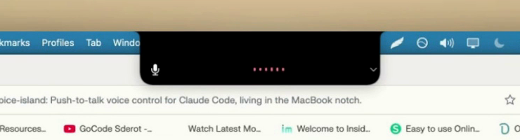
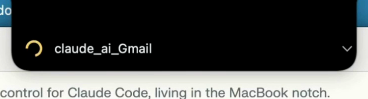
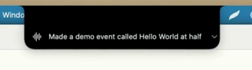
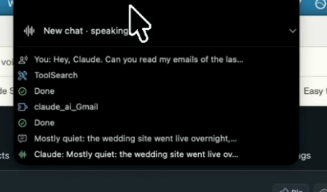

<div align="center">

# Claude Voice Island

### Hold the notch. Talk. Let go. Claude answers out loud.

Push-to-talk voice control for Claude Code, living inside the black notch of a MacBook.

[](https://github.com/clickspider/claude-voice-island/actions/workflows/ci.yml)
[](LICENSE)


<br>

https://github.com/user-attachments/assets/247b616d-bab8-422d-b926-dcdbf40e0287

</div>

- **It resumes a real chat.** Same session id, same project directory, same history. Not a fresh assistant that knows nothing about your work.
- **No API key.** It drives the `claude` command you already have, so it runs on your subscription and costs nothing extra.
- **Your voice stays on your Mac.** faster-whisper transcribes locally, and the recording is never uploaded.
- **It lives in the notch, not near it.** Idle, the window is the size of the physical cutout and filled with black.

## Why I built this

I don't like reading. I don't like typing much either. I like talking. I take in
more from one minute of somebody explaining a thing than from twenty minutes of
reading about it, and I can say a thought out loud long before I could type it.

Almost every tool assumes the opposite: read this, type that, leave the file
you're in, find the terminal, type it out, come back with your train of thought
gone. So I built one that works the way I do.

Voice only helps if it talks to the session that already knows what you're
working on, so it resumes the real chat, in its own directory, with its history.
The notch was the other half: every tool I tried that used it was a floating
panel sitting near it rather than in it.

## What people use it for

<table>
<tr>
<td width="33%" valign="top">

**Code**



Ask about the file you're looking at without leaving the file you're looking at.

</td>
<td width="33%" valign="top">

**Email**



Have the morning's mail read to you, and dictate the replies.

</td>
<td width="33%" valign="top">

**Calendar**



Check what's on today, and make an event by saying it.

</td>
</tr>
<tr>
<td width="33%" valign="top">

**Long agent runs**



With **Say each action out loud** on, you hear when it needs you.

</td>
<td width="33%" valign="top">

**The web**

Have an article fetched and summarised while you keep doing whatever you were
doing.

</td>
<td width="33%" valign="top">

**Thinking out loud**

Walking, sketching, hands busy. Explaining a problem to something that answers
back is faster than writing it down.

</td>
</tr>
</table>

Email, calendar and web run on whatever your own Claude Code can already reach.
This app provides none of them.

## Features

| Setting | What it does |
|---|---|
| **Hands-free (keep listening)** | Sends when you stop talking and reopens the microphone after Claude finishes. A conversation with nothing to hold. |
| **Push-to-talk key** | Option, Control or Command, held from any app. Or mouse only: hold the pill. |
| **Voice** | Five voices: Andrew, Brian, Ava, Emma, Ryan. |
| **Speech engine** | Microsoft neural voices, or the macOS voice offline. |
| **What Claude may do** | Ask me on screen, answer only, or run anything. See [Permissions](#permissions). |
| **Say each action out loud** | Speaks each tool call as it happens instead of you reading them. |
| **Hide chat names (screen sharing)** | Replaces the names in the picker with a position, four characters of the id, and how long ago you used it. |
| **Start at login** | Installs a launch agent. |

## Quick start

You need macOS 13 or newer, Python 3.11 or newer, and
[Claude Code](https://claude.com/claude-code) installed and signed in.

Paste this into Claude Code and let it do the whole thing:

```text
Clone https://github.com/clickspider/claude-voice-island into ~/claude-voice-island,
run ./scripts/setup.sh, then start it with ./start.command. Read the README first
and tell me which macOS permissions I will be asked for and why, before you run
anything. Stop and show me the command if any step fails.
```

Or do it by hand, which is four lines:

```bash
git clone https://github.com/clickspider/claude-voice-island.git
cd claude-voice-island
./scripts/setup.sh
./start.command
```

Either way, build a double-clickable app when you want it in your login items:

```bash
./scripts/make_app.sh      # creates ~/Applications/Claude Voice Island.app
```

The first time you hold to talk, macOS asks for microphone access. If you want a
push-to-talk key rather than the mouse, it asks for Accessibility too, because
watching a key outside your own app is exactly the kind of thing it should ask
about.

## What leaves your Mac

Being precise about this, because "local" is a word people stretch.

| Step | Where it happens |
|---|---|
| Speech to text | On your Mac. The recording is never uploaded. The model file downloads once, on first use. |
| The question and the answer | Claude Code, on your subscription, same as typing it. |
| Text to speech, `edge` | Sent to Microsoft's speech service, which is how those voices work. |
| Text to speech, `say` | On your Mac. Nothing leaves. |

The default is the Microsoft voice because it sounds far better. If you'd rather
nothing left the machine at all, Settings, **Speech engine**, macOS voice.

What you say isn't written to the log unless you turn on `log_transcripts`.
Settings and logs live under `~/Library/`, not in this repository, so a clone
never collects anything personal.

## Permissions

The default is **Ask me on screen**. The app runs a small MCP server of its own,
under two hundred lines with no dependencies, and hands Claude Code
`--permission-prompt-tool`, so an action becomes a dialog showing the actual
command. It fails closed: a timeout, an Escape, a dialog that can't open, all
mean deny.

Not everything reaches that dialog, and that's the part worth knowing before you
lean on it. Claude Code decides some calls are harmless and runs them without
consulting the permission tool at all. Measured on CLI 2.1.251, with the approver
denying everything:

| The call | Reached the dialog? |
|---|---|
| `Bash: touch <a file>` | Yes, and the denial held: no file. |
| `Bash: echo hello` | No. It just ran. |
| `Read` a file inside the chat's working directory | No. It just ran, and the contents came back. |
| `Read /etc/hosts`, outside that directory | Yes, and the denial held. |

Things that change something, and things that reach outside the chat's directory,
come to you. Read-only pokes inside the project don't. Which directory you point
a chat at does more work than the permission mode does, so it's worth a glance
before a long session.

The other two modes. **Answer only, no actions** runs the CLI in `dontAsk`, which
refuses anything needing permission, though `safe_tools` still runs. **Run
anything, never ask** passes `--dangerously-skip-permissions`, sits behind a
confirmation, and says so on the pill while it's on. Anything else in that field
is treated as `prompt`.

The full account, and what none of this protects against, is in
[SECURITY.md](SECURITY.md). Read that before you point this at something that
matters.

<details>
<summary><b>How it works</b></summary>

```
  hold                release
    │                     │
    ▼                     ▼
 microphone ──► faster-whisper ──► claude -p --resume <chat>
                 (on your Mac)              │
                                            │ stream of events
                                            ▼
                                     the activity list
                                            │
                                            ▼
                                   text to speech ──► out loud
```

Claude Code stores every session as a JSONL file under `~/.claude/projects/`. The
head of one gives the working directory and the first thing you typed, which is
how the menu shows "fix the login bug" instead of a UUID. The run is then read as
a stream, so each tool call becomes a row as it happens: `Run: pytest -q`,
`Edit parser.py`, `Browsing the web`. While closed, the window ignores mouse
events entirely, so the app underneath behaves as if it isn't there.

| What you do | What happens |
|---|---|
| Hold the pill, talk, release | The turn runs |
| Tap while it's speaking | It stops mid-sentence |
| Hold while it's speaking | It stops and listens to you instead |
| Click the ⌄ | Pick a chat, start a new one, change settings |
| Hover while it works | The activity list opens under the pill |

Grey idle, red listening, amber working, green speaking.

</details>

<details>
<summary><b>Settings that are only in the file</b></summary>

The ⌄ menu writes to
`~/Library/Application Support/ClaudeVoiceIsland/config.json`. Three keys have no
menu item:

| Key | Default | What it does |
|---|---|---|
| `whisper_model` | `base.en` | `small.en` is more accurate and slower |
| `safe_tools` | `["Glob", "Grep", "TodoWrite"]` | Tools pre-approved with `--allowedTools`, so they run without a dialog |
| `log_transcripts` | `false` | Write what you said and what Claude replied to the log |

`Read` is not on that list. What that buys you: a dialog for reads **outside** the
working directory, and nothing for reads inside it, because Claude Code has
already decided those are fine. If the project directory holds a `.env` you care
about, what's protecting it is which directory you pointed the chat at, not this
list.

</details>

<details>
<summary><b>Layout and development</b></summary>

```
voiceisland/
  config.py       settings, paths, logging
  audio.py        microphone capture
  speech.py       speech to text, text to speech
  claude.py       the bridge to the claude CLI
  sessions.py     reads your Claude Code chats
  approver.py     the MCP server that asks before anything runs
  activity.py     turns tool calls into a readable line
  dialogs.py      native yes/no prompts
  singleton.py    one instance at a time
  launchagent.py  start at login
  ui/
    app.py        the window and the event loop
    pill.py       the view, the state machine, the recording
    notch.py      the notch shape and the numbers behind it
    menu.py       the ⌄ menu
    symbols.py    cached, tinted SF Symbols
```

```bash
./venv/bin/python -m pytest      # 116 tests, no microphone needed
./venv/bin/ruff check .
```

They cover the parts where being wrong is expensive: what the approver does when a
dialog fails, what argv gets built for each permission mode, how chat files are
parsed, and what the speech engine is handed. None of it touches your real
settings, a microphone, or the network.

Pull requests welcome. See [CONTRIBUTING.md](CONTRIBUTING.md).

</details>

## Other harnesses

Today it speaks Claude Code, and nothing above the harness has to. The notch
window, push-to-talk, local transcription, the voices, the activity list and the
approval dialog are all indifferent to what is on the other end.

Three files know about Claude specifically, and they are small:

`claude.py` builds the argv for one turn and reads a stream of JSON events.
`sessions.py` finds resumable chats by reading `~/.claude/projects/*.jsonl`.
`approver.py` answers permission questions over MCP, which is how Claude Code asks them.

So an adapter for another tool needs four things: list resumable sessions, build
a command for one turn, turn that command's output into a stream of text, tool
calls and tool results, and say how that harness asks permission, if it asks at
all.

If you want this for Codex, Gemini CLI, Aider, opencode or anything else, say so
in [issue #3](https://github.com/clickspider/claude-voice-island/issues/3). The
first adapter is the one that sets the shape of the interface, so opinions on
that are worth more than votes.

## Limits

- macOS only, and the notch behaviour needs a Mac that has one. On any other
  screen it becomes a small pill you can drag wherever you want.
- Replies get read in full, so it's built for short spoken turns. Claude is asked
  to answer in two sentences.
- Every turn starts a `claude` process, so there's a few seconds of thinking
  before it speaks.
- English only, because it uses the English speech model.

## Credit

The notch shape follows the approach taken by
[Atoll](https://github.com/Renset/Atoll),
[boring.notch](https://github.com/TheBoredTeam/boring.notch) and
[DynamicNotchKit](https://github.com/MrKai77/DynamicNotchKit). Concave shoulders
flaring out to full width, straight sides, rounded bottom. Get those curves wrong
and it reads as a black rectangle taped under the camera.

Speech recognition is [faster-whisper](https://github.com/SYSTRAN/faster-whisper).
Voices are [edge-tts](https://github.com/rany2/edge-tts).

## License

MIT. See [LICENSE](LICENSE).
